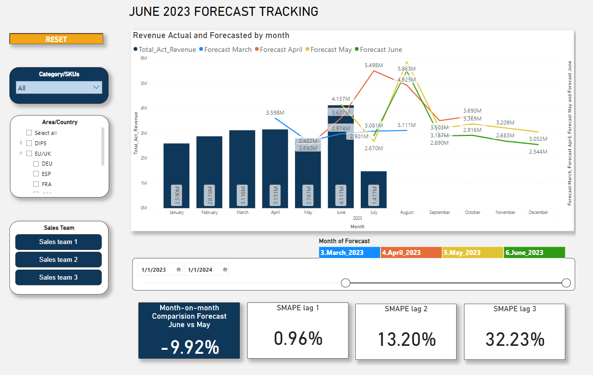
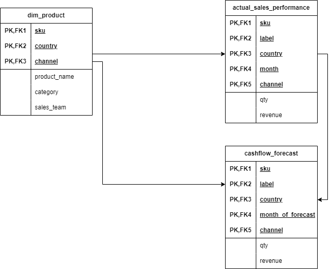
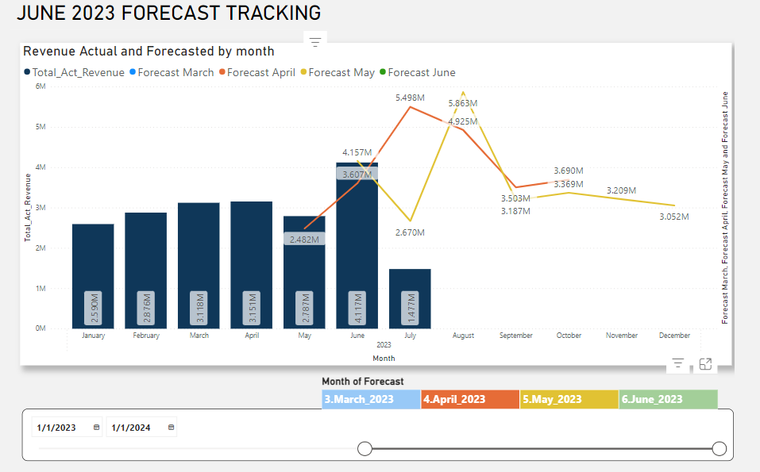
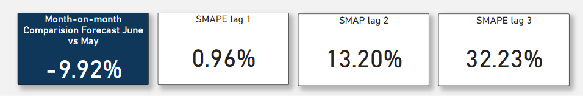

[Main portfolio](https://basic-produce.github.io)
## Context
I have worked for an e-commerce company, where cash flow forecasting was an essential part of the operation. The company's main market was American, and products were sold via Amazon. Needless to say, the competition was a real deal and to be able to make financial and operational decisions based on future trends and changes patterns of data, which were aggregated and analyzed to predict was a must-do. 

In my role, I involved in both maintaining the monthly rolling cash flow forecasting and evaluating the accuracy of the forecast. Evaluating the accuracy of the forecast was crucial because it proved the monthly rolling cash flow forecasting I produced each month was legit and reliable in making the right decisions.

Visisualization of rolling forecasting and forecast tracking combined, we called the report Forecast Tracking: [PowerBI embedded publish link](https://app.powerbi.com/view?r=eyJrIjoiYzFkM2YzMTQtMjhhOS00NGE0LTgzMzEtYTBlMTBmNWY3Nzk0IiwidCI6Ijk0YzBmYWUxLWY5MDEtNDMwZi05ZTkyLWJiMGZkNzMxZTlmNCIsImMiOjEwfQ%3D%3D)

***Disclaimer: The data was censored or edited to protect my previous company's privacy.***

Below is the basic database relationship, although, in reality, there can be a lot more data involved due to the business demand. 

The data to feed into PowerBI report was queried and exported as a CSV file to feed into PowerBI, however, more direct connection between PowerBI and the company’s database was under the setting up process.
## SQL Query
Full mySQL query can be found on this [link](https://github.com/basic-produce/Data_Port/blob/main/PowerBI/Forecast%20tracking/foreast_track_query.sql). Mostly try to join the revenue columns from actual and forecasting tables, redefine some attributes with CASE function and format the date time data type.
## Visualization

### Line Column Chart
The main visualization of the chart is the line column chart. The columns represents revenue has been gathered. While the lines are the forecast versions, usually 3 or 4 latest months.

The lines can be toggled on and off using the slicer below, which is the same colors of the lines. You can try it yourself. [Link](https://app.powerbi.com/view?r=eyJrIjoiYzFkM2YzMTQtMjhhOS00NGE0LTgzMzEtYTBlMTBmNWY3Nzk0IiwidCI6Ijk0YzBmYWUxLWY5MDEtNDMwZi05ZTkyLWJiMGZkNzMxZTlmNCIsImMiOjEwfQ%3D%3D)

Other slicers can also be applied:

- category/sku
- months
- country
- sales team

### Score cards:

The month of the version is June therefore, the month-on-month comparison would be between June and May. In this case, there was a reduction of nearly 10% of the total revenue forecasted in June compared to May, which is significant, and an ad-hoc meeting was appointed with the main person in charge of the forecast for cross-checking. 

And for the actual revenue of June versus the previous version. Lag 1 was compared the total of actual revenue of June with the forecasted couterpart in May forecast version, lag 2 compared with April, and so on. The further the lag was, the accuracy started to drop aggressively.  

## Conclusion
Although it may vary on businesses, these metircs more or less are the basic requirement in Forecast Tracking.

The column and lines combined with the element can be toggled on and off helps in the integrating data aspect, I don’t need to build too many sets of data or separate visualizations, in fact, I can always add more versions (more lines) and give people the choices whether to view that month or not.
