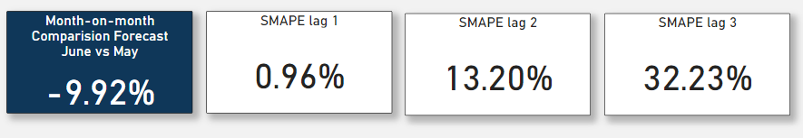

[Main portfolio](https://thong-pm.github.io/)

<iframe title="Business Forecast Tracking" width="1000" height="500" src="https://app.powerbi.com/view?r=eyJrIjoiYzFkM2YzMTQtMjhhOS00NGE0LTgzMzEtYTBlMTBmNWY3Nzk0IiwidCI6Ijk0YzBmYWUxLWY5MDEtNDMwZi05ZTkyLWJiMGZkNzMxZTlmNCIsImMiOjEwfQ%3D%3D" frameborder="0" allowFullScreen="true"></iframe>

## Context
Visualization! 

It's fun. Think of it as your first baby step before you start sprinting through the playground of things, like:

"Making financial and operational decisions based on crystal-gazing into future trends and the mystical dance of data patterns."

Joke aside.

Everybody has their expertise and problems.

By transforming data into visuals that are easy on the eyes. Helps the life of some co-worker's life-struggling looking at tables and numbers-a little bit easier.

This is one of the projects I've tackled when I clocked time at an E-Commerce firm where our battlefield was the US market, hustling products on Amazon.

### Resource:
pbix file: [pbix file](https://github.com/thong-pm/Data_Port/blob/45b2e9193cb5df68c06d621bad574048690db11f/PowerBI/1.%20Cashflow%20forecast%20tracking/Business%20Forecast%20Tracking.pbix)

mySQL file: [Query file](https://github.com/thong-pm/Data_Port/blob/cc4c26cfecd092f5300bec132919fbaf97e3a32a/PowerBI/1.%20Cashflow%20forecast%20tracking/foreast_track_query.sql)

live version: [PowerBI embedded publish link](https://app.powerbi.com/view?r=eyJrIjoiYzFkM2YzMTQtMjhhOS00NGE0LTgzMzEtYTBlMTBmNWY3Nzk0IiwidCI6Ijk0YzBmYWUxLWY5MDEtNDMwZi05ZTkyLWJiMGZkNzMxZTlmNCIsImMiOjEwfQ%3D%3D)

Visisualization of rolling forecasting and forecast tracking combined, we called the report Forecast Tracking

***Disclaimer: The data was censored or edited to protect my previous company's privacy.***

Below is the basic database relationship, in this case, it's a simple star schema meanwhile in reality, there can be a lot more data involved due to the business demand. 

## SQL Query
Words from the legends:

"Data should be transformed as far upstream as possible, and as far downstream as necessary."

I extracted and transformed the data using mySQL. 

Full mySQL query can be found in this link: [Full Query](https://github.com/thong-pm/Data_Port/blob/main/PowerBI/Forecast%20tracking/foreast_track_query.sql). 

Mostly try to join the revenue columns from actual and forecasting tables, redefine some attributes with CASE function and format the date time data type.
## Visualization

### Line Column Chart
The main visualization of the chart is the line column chart. 

The columns represents revenue has been gathered. While the lines are the forecast versions, usually 3 or 4 latest months.

The lines can be toggled on and off using the slicer below, which is the same colors of the lines. You can try it yourself. [Link](https://app.powerbi.com/view?r=eyJrIjoiYzFkM2YzMTQtMjhhOS00NGE0LTgzMzEtYTBlMTBmNWY3Nzk0IiwidCI6Ijk0YzBmYWUxLWY5MDEtNDMwZi05ZTkyLWJiMGZkNzMxZTlmNCIsImMiOjEwfQ%3D%3D)

Other slicers can also be applied:

- category/sku
- months
- country
- sales team

### Score cards:

The month of the version is June therefore, the month-on-month comparison would be between June and May. 

In this case, there was a reduction of nearly 10% of the total revenue forecasted in June compared to May, which was significant.

And for the actual revenue of June versus the previous version. Lag 1 was compared the total of actual revenue of June with the forecasted couterpart in May forecast version, lag 2 compared with April, and so on. 

"The further the lag was, the accuracy started to drop aggressively." said calmly the Data Analyst.

Ad-hoc meetings were appointed for cross-checking.

## Conclusion
Although it may vary on businesses, for my case, these metircs more or less are the a requirement in Forecast Tracking.

The columns and lines combined with the element can be toggled on and off helps in the data transformation aspect, only 1 csv file was extracted in the process. No need to build too many sets of data or separate visualizations.

In fact, I can always add more month versions (more lines) and add the slicers to select which lines should appear.

[Chack out more](https://thong-pm.github.io/)

